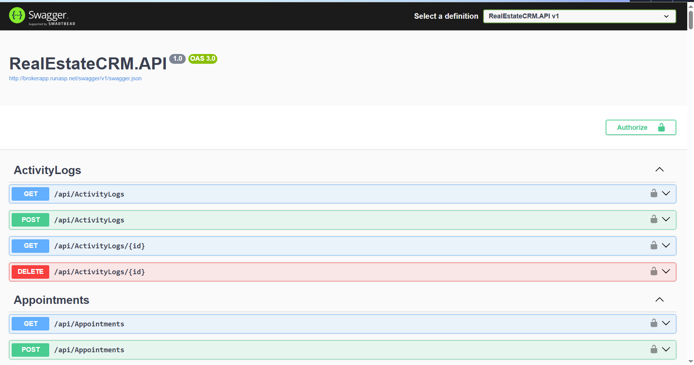
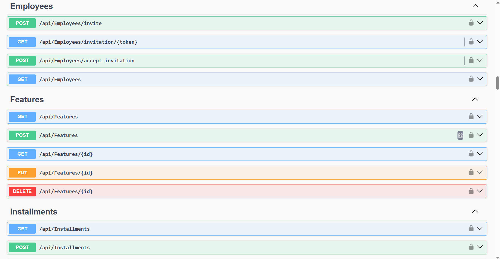
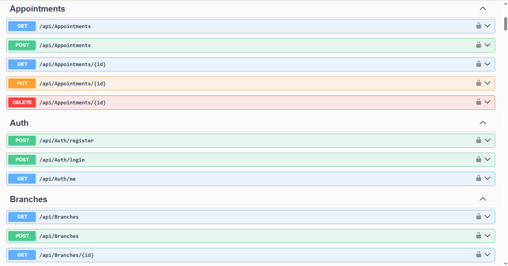

# 🏢 RealEstateCRM

### Multi-Tenant Real Estate CRM SaaS

A scalable Real Estate Customer Relationship Management (CRM) system designed to help real estate brokerage and marketing companies manage properties, customers, employees, deals, appointments, tasks, and daily business operations from a centralized platform.

> 🔒 The production source code is maintained in a private repository.  
> This repository is a public portfolio showcasing the project's architecture, features, technologies, and implementation concepts.

---

## 📌 Project Overview

RealEstateCRM is a multi-tenant SaaS platform where multiple real estate companies can use the same application while keeping their data completely isolated.

The system is designed around company-level data isolation, role-based access control, employee management, property management, customer management, sales operations, and subscription-based SaaS functionality.

### Main Goals

- Provide a centralized CRM for real estate companies.
- Support multiple companies within the same platform.
- Isolate each company's data using `CompanyId`.
- Manage employees and their permissions.
- Manage properties and property assignments.
- Manage customers and customer assignments.
- Track deals, appointments, tasks, and follow-ups.
- Provide secure authentication and authorization.
- Support subscription and company settings.
- Provide a scalable backend architecture.

---

# 🚀 Key Features

## 🏢 Multi-Tenant Architecture

The system supports multiple companies using the same application.

Each company has its own:

- Users
- Employees
- Properties
- Customers
- Deals
- Tasks
- Appointments
- Notifications
- Settings
- Subscription

Data isolation is enforced at the backend level using `CompanyId`.

---

## 👥 Employee Management

Company administrators can invite employees to join their company.

The invitation workflow includes:

1. Admin creates an employee invitation.
2. The invitation is associated with the company, role, and branch.
3. A secure invitation token is generated.
4. The employee opens the invitation.
5. The employee creates their password.
6. The backend creates the employee account.
7. The invitation is marked as accepted.

Employees cannot select their company or administrative role during registration.

---

## 🔐 Authentication & Authorization

The backend uses JWT-based authentication.

The system supports:

- JWT authentication
- Role-based authorization
- Permission-based access control
- Admin and Employee login types
- Password hashing using BCrypt
- Protected API endpoints
- Company-level authorization

Authentication and authorization are enforced on the backend to prevent unauthorized access even if the frontend is bypassed.

---

# 🏠 Property Management

The CRM provides functionality for managing real estate properties.

Property information includes:

- Property code
- Title
- Property type
- Purpose
- Status
- Price
- Area
- Bedrooms
- Bathrooms
- Floor
- Building number
- City
- District
- Address
- Location coordinates
- Description
- Featured status

Additional property functionality includes:

- Property images
- Property videos
- Property documents
- Property features
- Property status history
- Property assignments

A single property can be assigned to multiple employees/brokers.

---

# 👤 Customer Management

The system provides customer management functionality including:

- Customer profiles
- Customer assignments
- Follow-ups
- Customer requests
- Sales activities
- Appointments

Customers can be assigned to employees to allow sales teams to manage their leads and interactions.

---

# 💰 Deals & Sales

The CRM supports the sales workflow through:

- Deals
- Deal documents
- Customer relationships
- Property relationships
- Employee assignments
- Contracts
- Installments

This allows the company to track a deal from customer interaction through the sales process.

---

# 📅 Tasks & Appointments

Employees can manage their daily activities through:

- Tasks
- Appointments
- Customer follow-ups
- Notifications

This helps sales teams organize their workflow and maintain consistent customer communication.

---

# 🏬 Branch Management

The architecture supports company branches.

Users, properties, and other company resources can optionally be associated with a specific branch.

This allows the platform to scale from a single-office brokerage to companies operating across multiple locations.

---

# 💳 SaaS Subscription System

The platform includes subscription-related entities for supporting a SaaS business model.

The architecture includes:

- Plans
- Company subscriptions
- Features
- Company settings

This allows different companies to potentially operate under different subscription plans and feature sets.

---

# 🧱 Backend Architecture

The backend follows a layered architecture based on Clean Architecture principles.

```text
RealEstateCRM
│
├── RealEstateCRM.API
│   ├── Controllers
│   ├── DTOs
│   ├── Services
│   └── Configuration
│
├── RealEstateCRM.Application
│
├── RealEstateCRM.Domain
│   └── Entities
│
├── RealEstateCRM.Infrastructure
│   ├── Persistence
│   ├── Entity Framework Core
│   └── Database Configuration
│
└── RealEstateCRM.Shared
```
---

# 🛠️ Technology Stack

### Frontend
- Flutter
- Dart

### Backend
- ASP.NET Core Web API
- C#
- .NET 8
- Entity Framework Core

### Database
- Microsoft SQL Server

### Security
- JWT Authentication
- BCrypt Password Hashing
- Role-Based Authorization
- Permission-Based Access Control

### Tools
- Visual Studio
- Swagger / OpenAPI
- Git & GitHub

---

# 📸 API Preview

The backend API is documented and testable through Swagger / OpenAPI.

### 🔐 API & Authentication



### 👥 Employee Management



### 🏠 Property & CRM Management



## 🎨 Product UI/UX Preview

The following interface represents the proposed UI/UX for the complete RealEstateCRM application, including the dashboard, properties, customers, brokers, reports, and role-based workflows.


> UI/UX concept for the complete RealEstateCRM product. The current public repository focuses on the backend architecture and API.


---

# 🎯 Project Highlights

- Multi-tenant SaaS architecture
- Company-level data isolation
- Role & permission management
- Employee invitation system
- Property & customer management
- Deals, contracts and installments
- JWT authentication and authorization
- Clean Architecture
- RESTful Web API
- Flutter frontend
- SQL Server database

---

# 🔒 Source Code

The complete production source code is maintained in a private repository.

This public repository is intended as a portfolio and project overview.

---

# 👨‍💻 Developer

**Mostafa DEShmed**

Full-Stack Developer

**Technologies:** .NET • Flutter • SQL Server • REST APIs • Software Architecture
